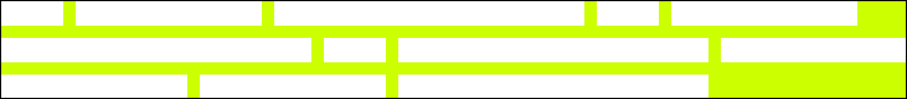

# ITCSS, BEM and Rethinking Design Practices

The way of writing CSS which did make me happy. 🤗

## Introduction

Hello 👋,

My name is Alexander Schranz ([alex_s_](https://twitter.com/alex_s_)) and I'm fulltime Webdeveloper
working on the [SULU CMS](https://sulu.io/?utm_source=github&utm_medium=repository&utm_campaign=alex-itcss)
and did based on that created a lot of websites.

After a long time of dissatisfaction I did find some time ago a way
to structure css the way which did make me happy to work with css.
This repository should show the structure and code syntax I used and
is mostly for me to reference new developers in the team to it.

It is a combination by the following sources:

 - 📐 [ITCSS](https://www.creativebloq.com/web-design/manage-large-css-projects-itcss-101517528) develop by [Harry Roberts (@csswizardry)](https://csswizardry.com/)
 - 🔥 [Rethinking Design Practices](https://www.youtube.com/watch?v=xxbc3wAztl0) by [Mark Dalgleish](https://twitter.com/markdalgleish)
 - ⚒️ [BEM](http://getbem.com/) a css methodology by [Yandex](https://yandex.com/)

At this place I really want to thank [Harry Roberts](https://twitter.com/csswizardry)
and [Mark Dalgleish](https://twitter.com/markdalgleish) as they were a
great inspiration how I write CSS today and they share a lot of there
knowledge ❤️. You definitely should follow them on Twitter.

**Table of Contents**

 - [Introduction](#introduction)
 - [ITCSS](#itcss)
 - [Objects](#objects) (Rethinking Design Practices)
 - [BEM](#bem)
 - [Conclusion](#conclusion)

## ITCSS

The directory structure you will find in the `src` directory comes
from [ITCSS](https://www.creativebloq.com/web-design/manage-large-css-projects-itcss-101517528)
which was build by [Harry Roberts (csswizardry)](https://csswizardry.com/)
a Consultant Web Performance Engineer.

I can really recommend to read the blog on [xfive.co](https://www.xfive.co/blog/itcss-scalable-maintainable-css-architecture)
to get more detail. Another example repository beside this one from the
developer of ITCSS [Harry Roberts](https://csswizardry.com/) can be found on [github.com/inuitcss](https://github.com/inuitcss/inuitcss).

But here a short overview about the directory structure or how they are called in ITCSS "Layers":

(Source: [xfive.co](https://www.xfive.co/blog/itcss-scalable-maintainable-css-architecture))

### ITCSS - `Settings`

The settings will just define scss variables like `font-sizes`,
`grid-gaps`, `font-families` and other things. Actually this
scss files will generate zero line of css code.

Common Examples:

 - [_breakpoint.scss](src/1-settings/_breakpoint.scss)
 - [_color.scss](src/1-settings/_color.scss)
 - [_font.scss](src/1-settings/_font.scss)
 - [_grid.scss](src/1-settings/_grid.scss)

More Examples:

 - [_h.scss](src/1-settings/_h.scss)
 - [_icomoon.scss](src/1-settings/_icomoon.scss)
 - [_paragraph.scss](src/1-settings/_paragraph.scss)
 - [_small.scss](src/1-settings/_small.scss)
 - [_zindex.scss](src/1-settings/_zindex.scss)

### ITCSS - `Tools`

Tools are function or mixins we use in our code. For example
mixins to make media queries easier or how to set a font size
on the elements. so this function and mixins are just define
to be reused in the other layers. Also this layer should output
0 lines of code.

Common Examples:

 - Nothing listed

More Examples:

 - [_container-link.scss](src/2-tools/_container-link.scss)
 - [_map-math.scss](src/2-tools/_map-math.scss)
 - [_media.scss](src/2-tools/_media.scss)
 - [_paragraph-spacing.scss](src/2-tools/_paragraph-spacing.scss)

### ITCSS - `Generic`

Generic is the first layer which will actually output any css
it will, in this layer basic things like `box-sizing`, `reset`
or `normalize` css are defined.

Common Examples:

 - _reset.scss or _normalize.scss
 - [_box-sizing.scss](src/3-generic/_box-sizing.scss)

More Examples:

 - [_focus.scss](src/3-generic/_focus.scss)
 - [_font.scss](src/3-generic/_font.scss)

### ITCSS - `Elements`

Elements define the basic styling of any tag its important here
that no class selectors are used inside this layer.

Common Examples:

 - [_a.scss](src/4-elements/_a.scss)
 - [_body.scss](src/4-elements/_body.scss)
 - [_img.scss](src/4-elements/_img.scss)
 - [_li.scss](src/4-elements/_li.scss)
 - [_p.scss](src/4-elements/_p.scss)
 - [_table.scss](src/4-elements/_table.scss)

More Examples:

 - [_button.scss](src/4-elements/_button.scss)
 - [_figure.scss](src/4-elements/_figure.scss)
 - [_small.scss](src/4-elements/_small.scss)
 - [_input.scss](src/4-elements/_input.scss)

### ITCSS - `Objects`

The difference between objects and components are sometimes
hard to understand if you were new to CSS methodologies. If
you are familiar with [SMACSS](http://smacss.com/) you can
see them as layout components. So objects are used to define
the spaces between your other components. They work most with
margins, width, display and similar layout css attributes.
Things like font-sizes, colors, backgrounds, should in my
opinion be not part of any objects component.

Beside the most common [media object](https://css-tricks.com/media-object-bunch-ways/)
I can recommend [Mark Dalgleish](https://twitter.com/markdalgleish)
talk about [Rethinking Design Patterns](https://www.youtube.com/watch?v=jnV1u67_yVg)
in the [Objects](#objects) section we will tak more about them.

Common Examples:

 - [_media.scss](src/5-objects/_media.scss)
 - [_grid.scss](src/5-objects/_grid.scss)
 - [_container.scss](src/5-objects/_container.scss)
 - [_stack.scss](src/5-objects/_stack.scss)
 - [_inline.scss](src/5-objects/_inline.scss)
 - _animations.scss

### ITCSS - `Components`

The components is the layer where we mostly will write the
css in project. As in this layer we define how the navigation,
footer, header and other components will look like. Its very
important that components itself do not define any spaces around
them. Have here a look at [Mark Dalgleish](https://twitter.com/markdalgleish)
Talk about [Rethinking Design Practices](https://www.youtube.com/watch?v=xxbc3wAztl0).

Common Examples:

 - [_menu.scss](src/6-components/_menu.scss)
 - [_footer.scss](src/6-components/_footer.scss)
 - [_header.scss](src/6-components/_header.scss)
 - [_button.scss](src/6-components/_button.scss)
 - [_teaser.scss](src/6-components/_teaser.scss)

More Examples:

 - _pagination.scss
 - _slider.scss

### ITCSS - `Utilities`

The utilities is the last layer of ITCSS it contains utility
and helper classes. Most common used to hide elements or some
utility classes

Common Examples:

 - [_none](src/7-utilities/_none.scss)
 - [_text](src/7-utilities/_text.scss)

More Examples:

 - _space.scss

## Objects

Object or layout components are one of the important things inside a project
if false used the whole project could be a mess. Here I will list my most used
object or layout components which every project could profit from.

### Object - `Container`

The container exist in mostly every common CSS Framework for 
example [Bootstrap](https://getbootstrap.com/docs/5.0/layout/containers/).
The task of a container object is to center content and give space
to it to the screen.  
This is mostly done to keep content readable because if the text
is too long in one line it is not longer readable to the user. 

### Object - `Grid`

Grid is also one of the most common object in CSS Framework.
Mostly today is worked with 12-column grid. Most designers
should keep here in mind that this 12-column grid is not only
available over the full width of the page. Also a 12 column
grid can be nested or is also available inside a container.

In my case I created my own grid which has no spaces at top
and bottom and just inside gaps. Also the width of the grid
items are controlled over separated width classes as they are
reusable on other none grid elements.

### Object - `Media`

The media object was first published by [Nicole Sullivan](https://twitter.com/stubbornella)
on her [blog](http://www.stubbornella.org/content/2010/06/25/the-media-object-saves-hundreds-of-lines-of-code/)
it is a reusable pattern for an object which has fixed with
(media) beside content (mostly text).

The container which has the media inside it will shrink the
minimal size it has and the container with the content will
grow the max size it gets. This pattern is common used on 
social media platform where profile images has fixed width
and the text content can grow the size of its parent
container.

The media object implementation can also be found on the
[CSS-Tricks Blogpost here](https://css-tricks.com/media-object-bunch-ways/)

### Object - `Stack`

The stack is an object which will make clear that all child
elements of them have the same space in between. It can
has additional modifiers so the gap between the elements
can be configured over them. The stack does not have any
effects on horizontal spacing to other elements just the
vertical space between the child elements in it.

This is object is also part of [Mark Dalgleish](https://twitter.com/markdalgleish)
Layout Components in his talk about [Rethinking Design Practices (Stack Component 13:00)](https://youtu.be/xxbc3wAztl0?t=780).

### Object - `Inline`

The inline object make it easy to work with components which
has a dynamic width. The inline object just make sure that all
components which are in there have the same space between them
vertical and horizontal. Like the other object and components
it will not have any space out of it.

This is object is also part of [Mark Dalgleish](https://twitter.com/markdalgleish)
Layout Components in his talk about [Rethinking Design Practices (Inline Component 13:50)](https://youtu.be/xxbc3wAztl0?t=830).

## BEM

Beside the structuring I use the widely spreaded [BEM](http://getbem.com/)
syntax to write my component. In most cases I try to avoid the
Modifiers as I think its better to have different block elements
then uncompatible modifiers. I common mistake I see here is for
example having one teaser BEM css with a lot of modifiers
instead of having different BEM teasers like `teaser-small`, `teaser-big`.

### BEM ITCSS Prefixes

If you look at example repository from [Harry Roberts](https://csswizardry.com/)
on [Github](https://github.com/inuitcss/inuitcss). You see is also using
the BEM syntax to create to write its components. But there is also a small
prefix in front of every components, object, utility class.

 - `o-` for `objects` e.g.: `o-grid`
 - `c-` for `components` e.g.: `c-button`
 - `u-` for `utilities` e.g.: `u-none`

Think this makes also reviews of the code easier. So you can easier find
errors that object define design instead of just layout or that components
accidentally adding spacing around them instead of using a object / layout
component for it. Linters could also make sure that 2 component classes
are not used on the same element to avoid strange side effects.

See here also the Blog Post [ITCSS with namespaces](http://csswizardry.com/2015/03/more-transparent-ui-code-with-namespaces/)
from [Harry Roberts](https://csswizardry.com/).

## Conclusion

The conclusion of my experience yet there a lot of principles and great
people out there in the web community which did share us great reusable ways
to build our CSS, so we should use them and try to improve them for our way
to write CSS. 

What I have to say to the end of this article, I hope I could give you a
great overview about how I write CSS and maybe you could find here some
inspiration, every feedback is welcome.

Maybe you will not use ITCSS in the future I still recommend you to use
some widely share CSS Methodology (e.g.: SMACSS, OOCSS, Atomic Design, ...)
or use just one as fundamental base and document your changes for it in
public repository. This will help you to get other programmers easier
into your codebase and help you to develop your websites faster.

Thank you for reading this!

More articles on Github from me can be found [here](https://github.com/topics/alexander-schranz-article).
